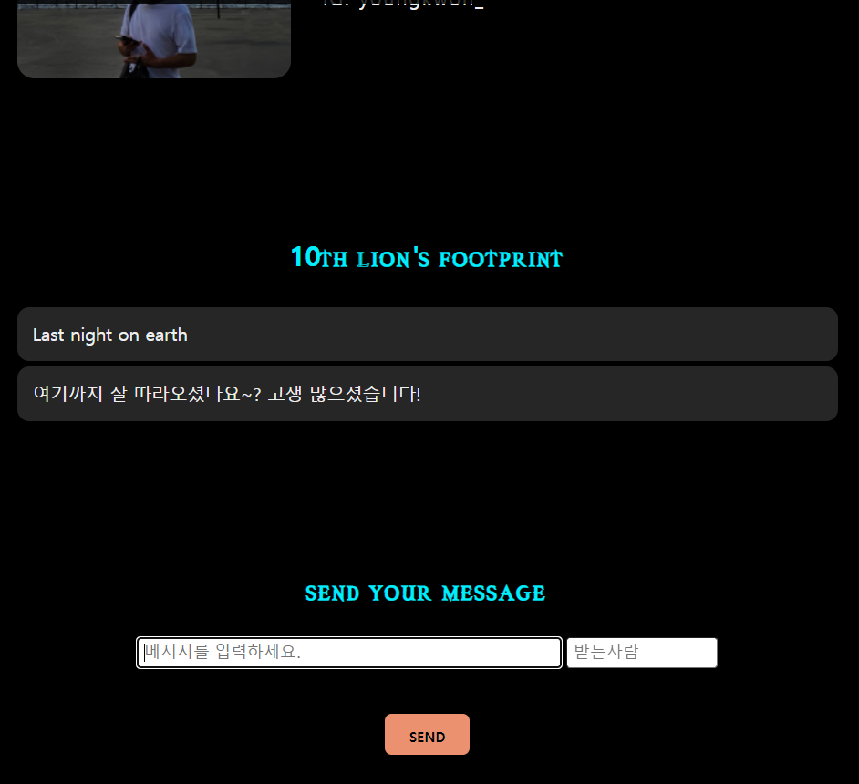

# Session06 Django light server

DB를 이용하여 서버 구현 -> Dynamic web

mvt - model view template => 장고
장고 하나만으로 웹페이지,서버,DB 뚝딱

서버와 프론트엔드는 구분된 거여서 서버와 프론트엔드간 정보전달에 시간이 소요됐는데 
장고는 안에 코드가 전부 존재하기 때문에 서버와 프론트엔드간의 이동에 시간이 X

-------------------------------------

cd ~ : 홈디렉토리로 이동

ls : 리스트 표시 
ls -l : 일렬로 주루룩 리스트 표시 
(중요)ls -a : 리스트 죄다 싹다 표시. 숨김폴더까지!  
mkdir : 새로운 폴더 만들기  
mv(move) : 잘라내기 --> 또 다른 기능 : 이름 바꾸기 가능 : mv test1111 test2222  
 
test3333 디렉토리 만들고 test2222안에 넣는 법 
mv test3333 test2222  
확인하는 법 cd test2222 -> ls   
 
이전 디렉토리로 이동하는 법 : cd ..  
 
cp(copy) : cp -r test4444 test2222 : -r옵션을 붙여야됨. 
mv는 잘라내기라 원래 위치에서 없어지지만 cp는 복사라서 원래 위치에도 남아있음 
 
pwd : 현재 위치를 알려줌 (현재 작업중인 위치 알려줌) 
 
Tip! : 홈디렉토리 안에 workplace 만들고 그 안에 프로젝트 만들면 좋음 
--> 각 프로젝트 안에서 git init 하면 됨. init이 꼬일 일이 없음.
 
 
---------------------------------
 
가상환경 : 라이브러리 버전의 차이가 있을 때 가상환경을 통째로 넘겨주면 버전 충돌이 발생하지 않음. 
+ 메모리 낭비가 발생하지 않음  
virtual machine != virtual environment 
 
virtualenv (가상환경 이름) : convention으로 virtualenv myvenv 
 
127.0.0.1 : 모든 컴퓨터에서 로컬 주소 - 8000은 내 주소
  
ex: 프로그램 이름 : 인스타그램 
    앱 이름 : 댓글쓰기앱, 팔로우 앱 

----------------------
 
url(uniform resource locator)의 역할은 app으로 전달시켜주는 것! 
 
AutoField --> 자동으로 숫자가 증가됨 
null=false -> 리시버 or 메시지 내용이 없으면 안 됨 
장고의 명령어 중, migrate, makemigrations 와 같은 명령어가 있습니다.  
이러한 명령어는 models.py에 정의된 모델의 생성/변경 내역을 히스토리 관리,  
데이터베이스에 적용 등과 같은 기능을 제공하여 손쉽게 데이터베이스의 구조를 바꿀 수 있습니다. 
 
 
cors => 프로토콜,ip,포트 번호가 다른 프로그램끼리 정보 공유할 때

